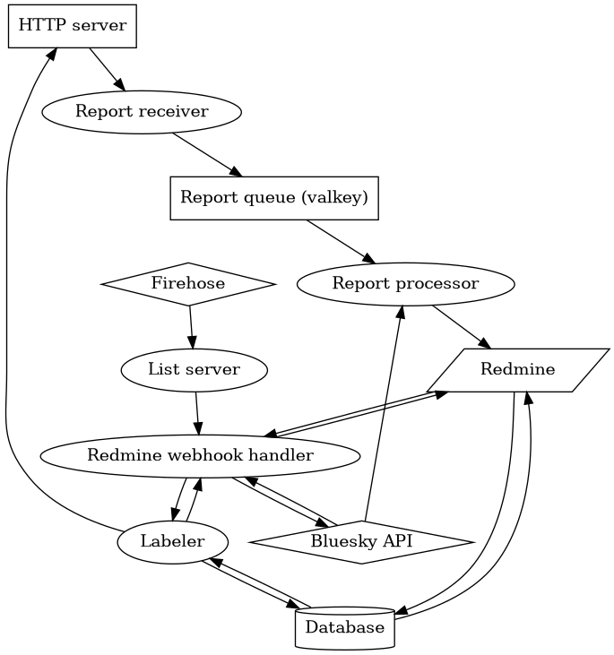

# Bluesky modkit

Moderation stack for Bluesky, based on [Redmine](https://www.redmine.org/).

## Getting started

#### 1. Environment vars

Run `make .env` and edit `.env` file.

#### 2. Create initial configuration

Run `make gen-config`.

In `config/config.yaml` update:

  * `did` to the DID of your moderation account.
  * `password` to the password of the same account.
  * `publicHostname` to the hostname your instance will be reachable from outside world.

#### 3. Configure moderation account to act as a labelers

Run `go run ./cmd/account-setup`.

If your DID document needs to be updated, it will ask you to provide confirmaion token emailed to you. Re-run the same command with added `--token` argument to perform the change.

If no changes are needed, it will just tell you that everthing is OK.

#### 4. Start everything

Run `make up`.

#### 5. Log into Redmine

Default credentials are `admin`/`admin`.

Create a new account for yourself and add it to "Moderators" group. Update `config/mappings.yaml` with your username and DIDs of any accounts you plan to send in-app reports from. Run `docker compose restart redmine-handler report-processor` to pick up the changes.

## System diagram

## Monitoring

TODO
